<h3 align="center">
  
</h3>

# Clasificador de imágenes

Desarrollo de un algoritmo de clasificación basado en CNN capaz de distinguir entre 5 tipos diferentes de Pokémon: 

*  Squirtle
*  Bulbasur
*  Charmander
*  Pikachu
*  Mewtwo

Se dispone de un set de datos balanceado que contiene aproximadamente 231 imágenes
de Squirtle, 240 de Bulbasur, 245 de Charmander, 239 de Pikachu y 245
de Mewtwo.

Por cuenta propia, modifiqué el dataset incorporando más muestras de cada uno y eliminando algunas que podían dar lugar a confusión.
De todas formas, el dataset que incorporo a continuación es el original y permite, aún sin limpiarlo, obtener los mismos resultados.

# Performance

[Dataset Pokemon](https://drive.google.com/open?id=1Pojyhp5ZJ-0MB9ySf23Mf2-gr3NeGRR9)

**Descripción:** Cinco clases a distinguir.

**Training:** 1123 imágenes para las 5 clases

**Validation:** 122 imágenes para las 5 clases

# Consejos del desarrollo

*  Empleo de Keras
*  Vectores de etiquetas a partir de los nombres de los directorios destino
*  Normalización y re-escalamiento de las imágenes, así como división entre conjunto entrenamiento (90%) y validación (10%).
*  Uso de **Data augmentation** debido al escaso número de ejemplos. Una muy buena opción habría sido tener aproximadamente 1000 ejemplos / pokemon.
*  No es necesario el uso de la **API funcional** debido a que no tendremos 2 ramas diferenciadas.
*  Ir construyendo una red sencilla e ir incorporando nuevas capas **Dropout** y **fully connected**

## model_1

    _________________________________________________________________
    Layer (type)                 Output Shape              Param #   
    =================================================================
    conv2d (Conv2D)              (None, 64, 64, 32)        896       
    _________________________________________________________________
    batch_normalization (BatchNo (None, 64, 64, 32)        128       
    _________________________________________________________________
    max_pooling2d (MaxPooling2D) (None, 21, 21, 32)        0         
    _________________________________________________________________
    dropout (Dropout)            (None, 21, 21, 32)        0         
    _________________________________________________________________
    conv2d_1 (Conv2D)            (None, 21, 21, 64)        18496     
    _________________________________________________________________
    batch_normalization_1 (Batch (None, 21, 21, 64)        256       
    _________________________________________________________________
    max_pooling2d_1 (MaxPooling2 (None, 10, 10, 64)        0         
    _________________________________________________________________
    dropout_1 (Dropout)          (None, 10, 10, 64)        0         
    _________________________________________________________________
    conv2d_2 (Conv2D)            (None, 10, 10, 64)        36928     
    _________________________________________________________________
    batch_normalization_2 (Batch (None, 10, 10, 64)        256       
    _________________________________________________________________
    max_pooling2d_2 (MaxPooling2 (None, 5, 5, 64)          0         
    _________________________________________________________________
    dropout_2 (Dropout)          (None, 5, 5, 64)          0         
    _________________________________________________________________
    conv2d_3 (Conv2D)            (None, 5, 5, 128)         73856     
    _________________________________________________________________
    batch_normalization_3 (Batch (None, 5, 5, 128)         512       
    _________________________________________________________________
    max_pooling2d_3 (MaxPooling2 (None, 2, 2, 128)         0         
    _________________________________________________________________
    conv2d_4 (Conv2D)            (None, 2, 2, 128)         147584    
    _________________________________________________________________
    batch_normalization_4 (Batch (None, 2, 2, 128)         512       
    _________________________________________________________________
    max_pooling2d_4 (MaxPooling2 (None, 1, 1, 128)         0         
    _________________________________________________________________
    dropout_3 (Dropout)          (None, 1, 1, 128)         0         
    _________________________________________________________________
    Input_layer (Flatten)        (None, 128)               0         
    _________________________________________________________________
    Hidden_layer_1 (Dense)       (None, 1024)              132096    
    _________________________________________________________________
    batch_normalization_5 (Batch (None, 1024)              4096      
    _________________________________________________________________
    dropout_4 (Dropout)          (None, 1024)              0         
    _________________________________________________________________
    Hidden_layer_2 (Dense)       (None, 512)               524800    
    _________________________________________________________________
    batch_normalization_6 (Batch (None, 512)               2048      
    _________________________________________________________________
    dropout_5 (Dropout)          (None, 512)               0         
    _________________________________________________________________
    Hidden_layer_3 (Dense)       (None, 64)                32832     
    _________________________________________________________________
    batch_normalization_7 (Batch (None, 64)                256       
    _________________________________________________________________
    dropout_6 (Dropout)          (None, 64)                0         
    _________________________________________________________________
    Output_layer (Dense)         (None, 5)                 325       
    =================================================================
    Total params: 975,877
    Trainable params: 971,845
    Non-trainable params: 4,032
    _________________________________________________________________

## Resultados

<h3 align="center">
  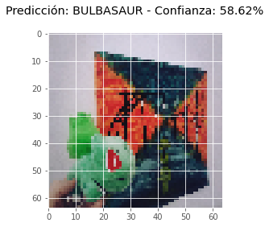
</h3>

<h3 align="center">
  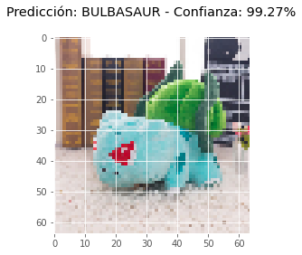
</h3>

<h3 align="center">
  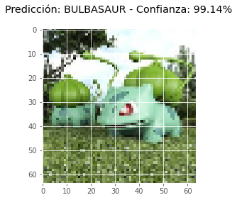
</h3>

<h3 align="center">
  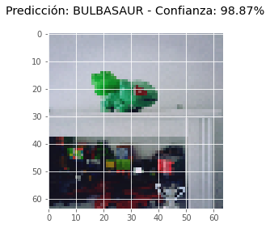
</h3>

<h3 align="center">
  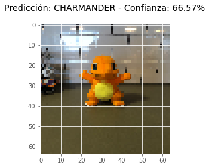
</h3>

<h3 align="center">
  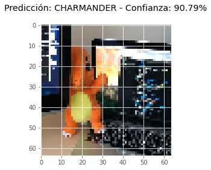
</h3>

<h3 align="center">
  
</h3>

<h3 align="center">
  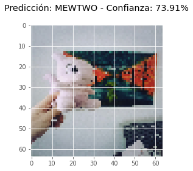
</h3>

<h3 align="center">
  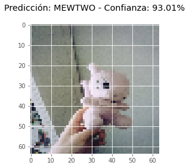
</h3>

<h3 align="center">
  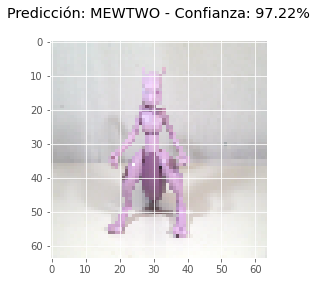
</h3>

<h3 align="center">
  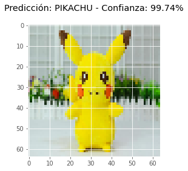
</h3>

<h3 align="center">
  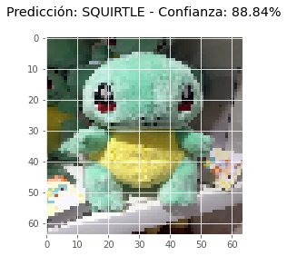
</h3>
